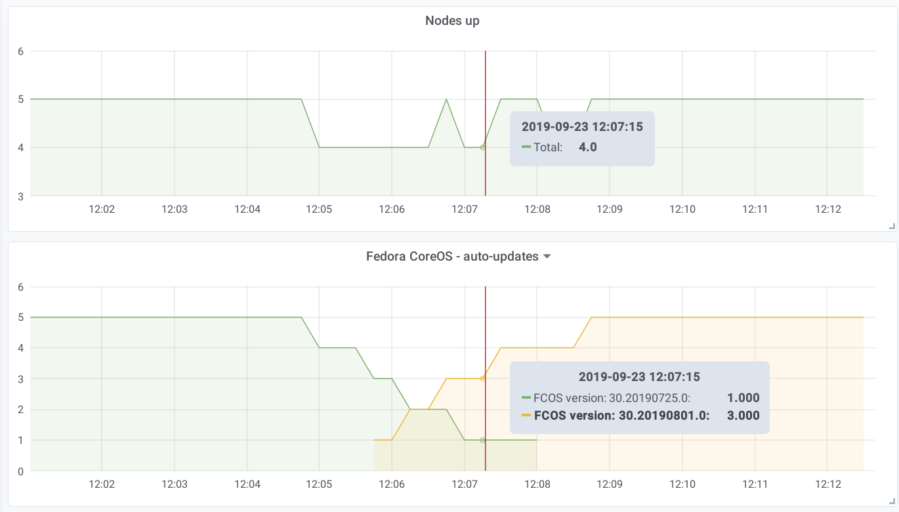

# Zincati

Zincati is an auto-update agent for Fedora CoreOS hosts.

It works as a client for [Cincinnati] and [rpm-ostree], taking care of automatically updating/rebooting machines.

Features:
 * Agent for [continuous auto-updates][auto-updates], with support for phased rollouts
 * [Configuration][configuration] via TOML dropins and overlaid directories
 * Multiple [update strategies][updates-strategy] for finalization/reboot
 * Local [maintenance windows][strategy-periodic] on a weekly schedule for planned upgrades
 * Internal [metrics][metrics] exposed over a local endpoint in Prometheus format
 * [Logging][logging] with configurable priority levels
 * Support for complex update-graphs via [Cincinnati protocol][cincinnati-protocol] (with rollout wariness, barriers, dead-ends and more)
 * Support for [cluster-wide reboot orchestration][strategy-fleetlock], via an external lock-manager

[Cincinnati]: https://github.com/openshift/cincinnati
[rpm-ostree]: https://github.com/coreos/rpm-ostree

[auto-updates]: ./docs/usage/auto-updates.md
[configuration]: ./docs/usage/configuration.md
[updates-strategy]: ./docs/usage/updates-strategy.md
[strategy-periodic]: ./docs/usage/updates-strategy.md#periodic-strategy
[metrics]: ./docs/usage/metrics.md
[logging]: ./docs/usage/logging.md
[cincinnati-protocol]: ./docs/development/cincinnati/protocol.md
[strategy-fleetlock]: ./docs/usage/updates-strategy.md#lock-based-strategy
